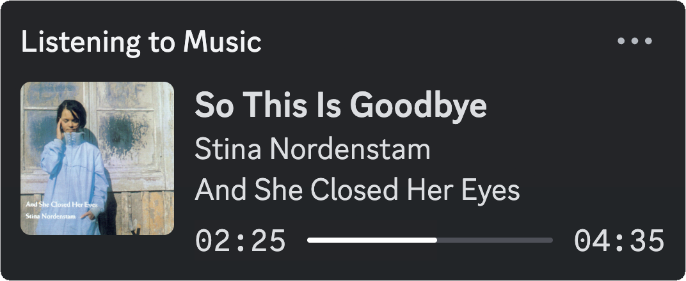

# Discord Music RPC

  

## supported services

- Spotify
- Plex/Plexamp (cover art not currently supported)
- Last.fm
- Via userscript
  - SoundCloud
  - YouTube

## setup

- Run the script once, a config file `config.yaml` will be generated:

| **Operating System** | **Config Directory Path**                         |
| -------------------- | ------------------------------------------------- |
| Windows              | `%LOCALAPPDATA%\discord-music-rpc`                |
| macOS                | `~/Library/Application Support/discord-music-rpc` |
| Linux                | `~/.local/share/discord-music-rpc`                |

- Enable services:
  - Last.fm - create an API account at <https://www.last.fm/api/account/create> and copy your API key and fill out your username in `config.yaml`
  - Spotify - create an app at <https://developer.spotify.com/dashboard> with a Redirect URI of <http://localhost:8888/callback> and copy the Client ID and Secret into `config.yaml`
  - Plex/Plexamp - [Get an auth token](https://support.plex.tv/articles/204059436-finding-an-authentication-token-x-plex-token/) and copy it into `config.yaml` along with your server URL
  - YouTube & SoundCloud - see [install the userscript](#install-the-userscript)

### install the userscript

To enable YouTube and SoundCloud support, install the helper userscript. To do this:

- Install a userscript manager (I recommend [ViolentMonkey](https://violentmonkey.github.io/))
- Install the userscript by opening [the source code](https://github.com/f0e/discord-music-rpc/raw/main/extensions/discord-music-rpc-helper.user.js)

## disclaimer

This isn't really meant for public use _yet?_. Check out [discord-music-presence](https://github.com/ungive/discord-music-presence) if you want a more fully-featured rpc client. It is closed-source though and only works with media players which report the currently playing song to the OS - i.e. not SoundCloud in browser, Plexamp or Last.fm.
